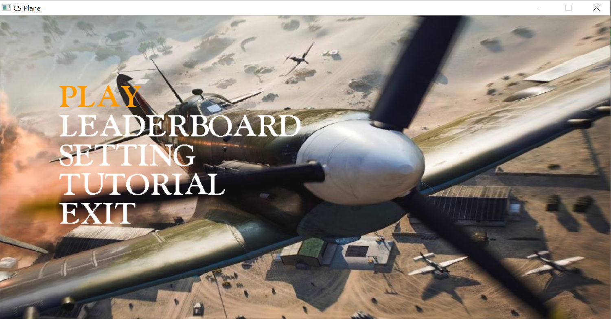
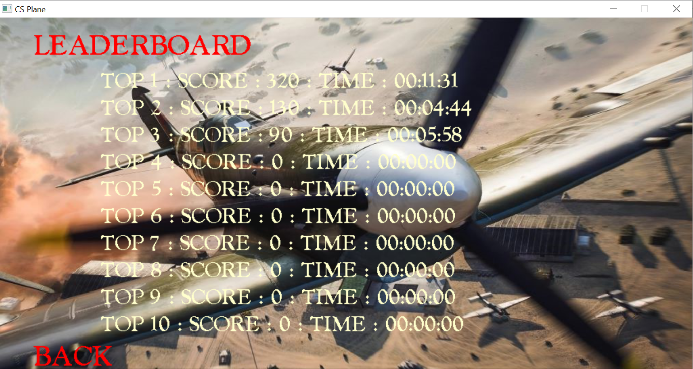
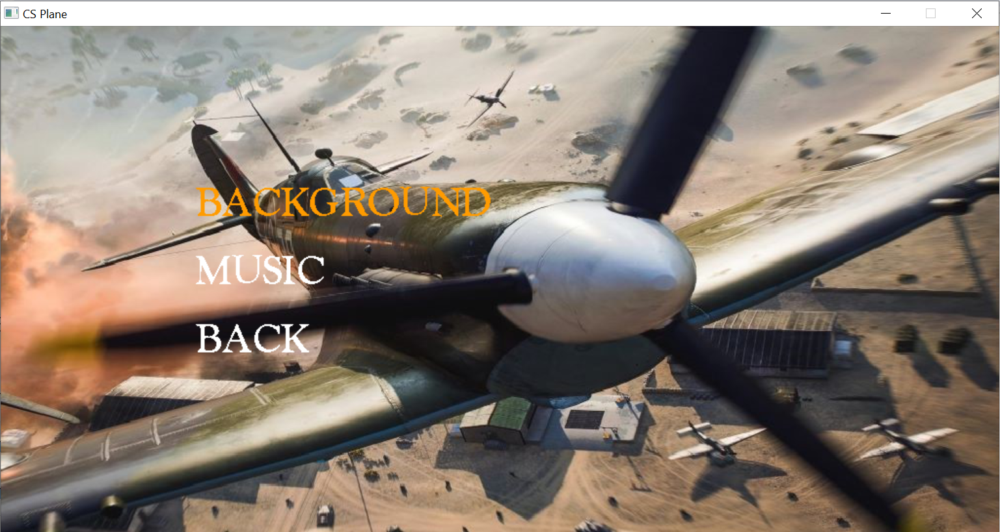
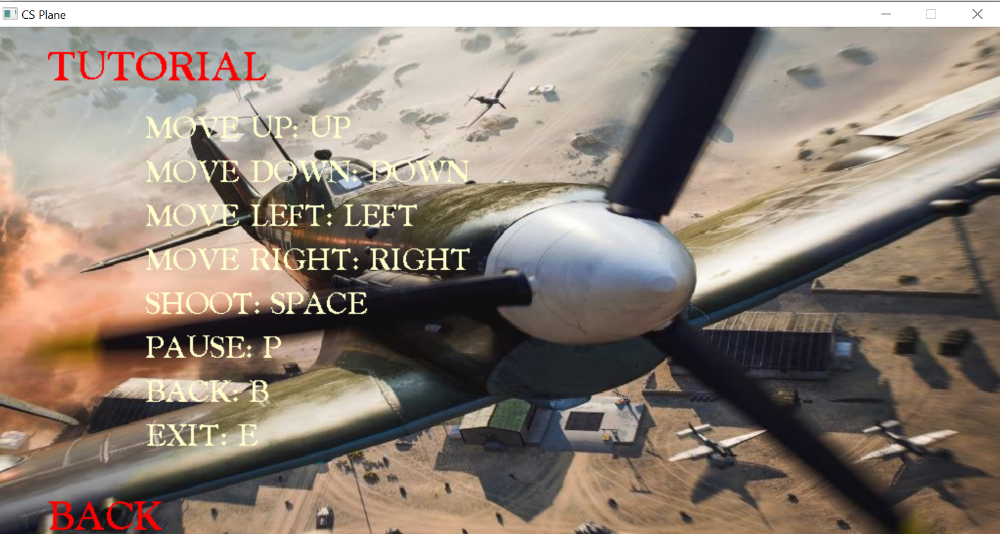
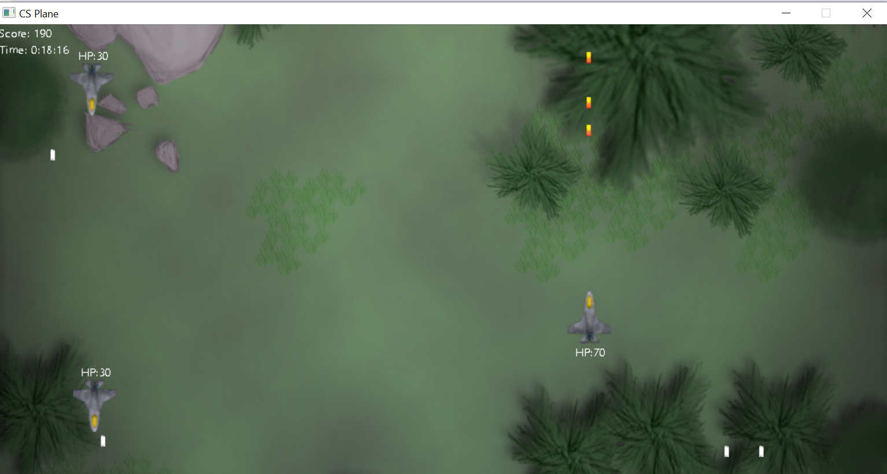
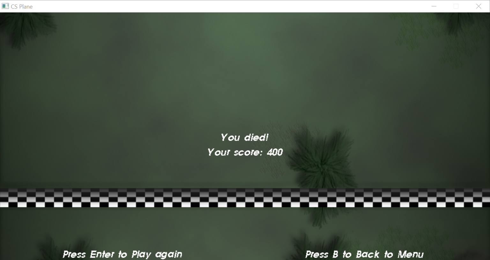

# CS-plane-BTL_LTNC
Plane shooter using c++ and sdl2 lib 
video demo: https://drive.google.com/file/d/1ZSkrUxB5aGj_wxr0t92WXuPqRaHmDcbc/view?usp=sharing

# Giới thiệu game

Với mục đích đem đến cho các bạn một phương pháp giải trí hiệu quả sau những giờ học và làm việc căng thẳng, mình xin giới thiệu sản phẩm CS Plane. Game CS Plane là một game hành động đầy kịch tính và hấp dẫn, nơi người chơi sẽ điều khiển một chiếc máy bay chiến đấu để tiêu diệt các kẻ thù trên không. Trong trò chơi, người chơi sẽ phải đối mặt với hàng loạt các đợt tấn công từ những máy bay địch, trực thăng, và các loại vũ khí hạng nặng khác. Mục tiêu của người chơi là sống sót qua các màn chơi, tiêu diệt kẻ thù và ghi điểm cao nhất có thể. 
Với lối chơi đơn giản nhưng không kém phần kịch tính, CS Plane là một lựa chọn tuyệt vời cho những ai yêu thích thể loại game hành động và muốn thử thách bản thân với những trận đấu nảy lửa trên bầu trời.

# Cách tải game

**Bước 1:** Clone repo này về máy.  
Hoặc Chọn Code -> Download Zip.

**Bước 2:** Cài mingw.  
Hoặc sử dụng 1 IDE có thể chạy c++ mà bạn muốn(codeblock, vs code, ...).

**Bước 3:** Tải và thêm thư viện SDL vào IDE.  
Link SDL: https://github.com/libsdl-org

**Bước 4:** Build và run main.cpp.  
Nếu không build được thì có thể mở CMD, cd đến thư mục chứa code rồi nhập: g++ -Isource/include/SDL2 -Lsource/lib -o main *.cpp -lmingw32 -lSDL2main -lSDL2 -lSDL2_image -lSDL2_ttf -lSDL2_mixer  
Chờ chạy xong thì nhập tiếp: mingw32-make run

**Bước 5:** Bắt đầu chơi game thôi!

# Các chức năng chính:
## Bắt đầu game
Ấn một phím bất kì rồi chọn start bằng cách nhấn enter.

## Xem bảng xếp hạng

Chọn phần leaderboard để xem điểm cao nhất và thời gian chơi.

## Chỉnh cài đặt
Bạn có thể thay đổi hình nền và bản nhạc yêu thích trong khi chơi game trong mục setting.

Hiện tại có 3 hình nền và 3 bản nhạc khác nhau mà bạn có thể chọn. Trong khi chơi thì sau khi lên level hình nền cũng sẽ thay đổi.

## Xem hướng dẫn chơi
Chọn mục tutorial để xem hướng dẫn chơi.

## Gameplay
Phần chơi chính gồm các vật thể như máy bay đồng minh, máy bay địch, đạn, tên lửa,... và bảng tính điểm, thời gian với độ khó tăng dần theo thời gian.

Khi qua một khoảng thời gian nhất định, bạn sẽ đi qua vạch đích và độ khó sẽ tăng lên.

  

Khi bạn tiêu diệt máy bay địch cũng sẽ có xác suất rơi ra vật phẩm giúp tăng máu của bạn.
                                                                
## Thua cuộc

Khi hp về 0, bạn có thể chọn chơi lại bằng cách nhấn enter hoặc nhấn B để quay lại menu.

# Đồ họa của game

Hinh nền lấy từ game BattleField 2042, background và music đều lấy từ trên google.

# Tham khảo và nâng cấp

Học logic và các chức năng cơ bản trên youtube: https://www.youtube.com/watch?v=LT6IPr2W8dw&list=PLmwzeqwf733-AjK8BXqMfcKyRwrBOHNRg&pp=iAQB  

Đã có kinh nghiệm làm game bomberman trong môn oop: https://github.com/Traanminhquan/bomberman.git  
So với base game ban đầu với các chức năng cơ bản thì đã thêm một số cải tiến như thay đổi hình và nhạc nền, thêm leaderboard, tutorial, thêm một số loại enemy và thêm chức năng rơi vật phẩm.
